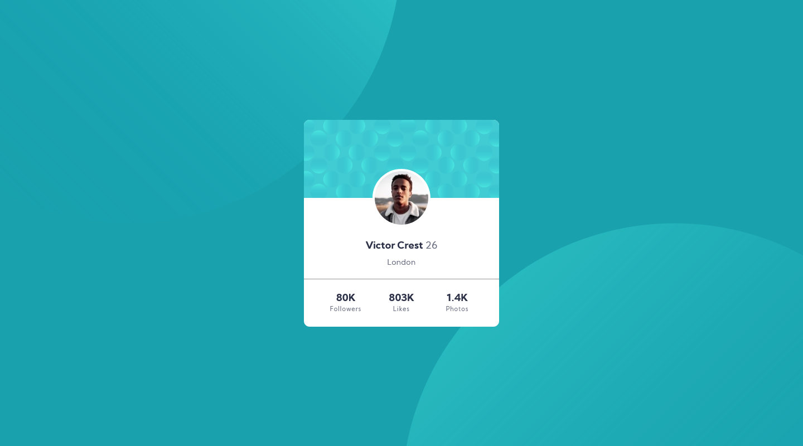

# Frontend Mentor - Profile card component solution

This is a solution to the [Profile card component challenge on Frontend Mentor](https://www.frontendmentor.io/challenges/profile-card-component-cfArpWshJ). Frontend Mentor challenges help you improve your coding skills by building realistic projects. 

## Table of contents

- [Overview](#overview)
  - [The challenge](#the-challenge)
  - [Screenshot](#screenshot)
  - [Links](#links)
- [My process](#my-process)
  - [Built with](#built-with)
  - [What I learned](#what-i-learned)
- [Author](#author)

**Note: Delete this note and update the table of contents based on what sections you keep.**

## Overview

### The challenge

- Build out the project to the designs provided

### Screenshot



### Links

- Solution URL: [Solution](https://www.frontendmentor.io/solutions/mobile-first-site-using-card-KiynL8gRl)
- Live Site URL: [Live site](https://joco9308.github.io/fm-profile-card-component/)

## My process

### Built with

- Semantic HTML5 markup
- CSS custom properties
- Flexbox
- Mobile-first workflow

### What I learned

Background composed with multiple images and a color.

```css

body {
    background-attachment: fixed;
    background: 
        url(images/bg-pattern-top.svg) top calc(50vh - 978px) left calc(50vw - 978px) no-repeat,
        url(images/bg-pattern-bottom.svg) bottom calc(50vh - 978px) right calc(50vw - 978px) no-repeat;
    background-color: hsl(185, 75%, 39%);
    height: 100%;
    overflow: hidden;
    display: flex;
    align-items: center;
    justify-content: center;
}
```

## Author

- Frontend Mentor - [@joco9308](https://www.frontendmentor.io/profile/joco9308)